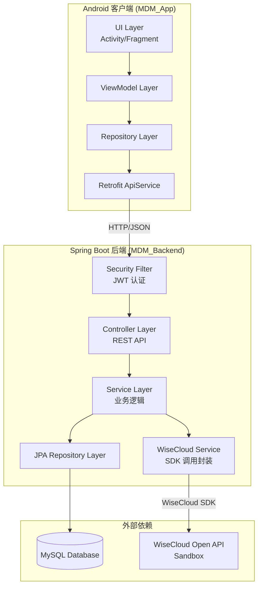
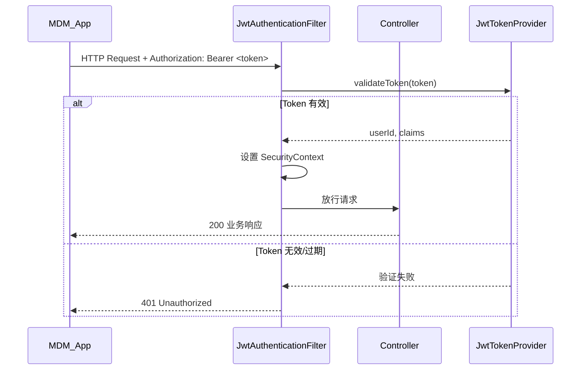
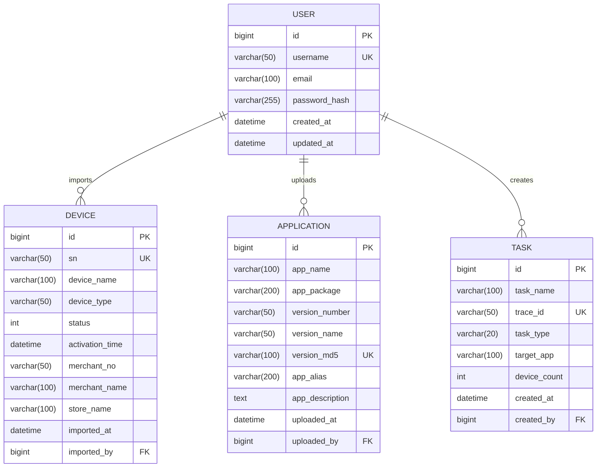

# 设计文档 — WiseCloud 移动设备管理应用（MDM）

## 概述

本设计文档描述 WiseCloud MDM 应用的技术架构与实现方案。系统采用前后端分离架构：Spring Boot 后端（MDM_Backend）提供 RESTful API 并通过 WiseCloud Java SDK 对接开放平台；Android 客户端（MDM_App）通过 Retrofit 调用后端接口提供操作界面。

核心技术栈：
- 后端：Spring Boot 3.x + Spring Security + JWT + JPA/Hibernate + MySQL
- SDK：WiseCloud OpenAPI Java SDK（Sandbox 模式）
- 客户端：Android（Kotlin）+ Retrofit + OkHttp + Jetpack Navigation
- 数据库：MySQL 8.x

## 架构

### 高层架构



### 后端分层架构

```
com.wisecloud.mdm
├── config/              # 配置类（Security、WiseCloud SDK、CORS）
├── controller/          # REST Controller
│   ├── AuthController
│   ├── DeviceController
│   ├── ApplicationController
│   └── TaskController
├── service/             # 业务逻辑层
│   ├── AuthService
│   ├── DeviceService
│   ├── ApplicationService
│   ├── TaskService
│   └── WiseCloudService  # SDK 调用统一封装
├── repository/          # JPA Repository
│   ├── UserRepository
│   ├── DeviceRepository
│   ├── ApplicationRepository
│   └── TaskRepository
├── entity/              # JPA 实体
│   ├── User
│   ├── Device
│   ├── Application
│   └── Task
├── dto/                 # 请求/响应 DTO
│   ├── request/
│   └── response/
├── security/            # JWT 工具类与过滤器
│   ├── JwtTokenProvider
│   └── JwtAuthenticationFilter
├── exception/           # 全局异常处理
│   ├── GlobalExceptionHandler
│   └── WiseCloudApiException
└── util/                # 工具类
```

### Android 客户端架构

```
com.wisecloud.mdm.app
├── data/
│   ├── api/             # Retrofit 接口定义
│   │   └── MdmApiService
│   ├── model/           # 数据模型
│   ├── repository/      # 数据仓库
│   └── local/           # SharedPreferences Token 存储
├── ui/
│   ├── auth/            # 登录/注册页面
│   ├── home/            # 首页（设备概览 + 搜索）
│   ├── device/          # 设备详情页
│   ├── install/         # 批量安装向导
│   ├── uninstall/       # 批量卸载流程
│   └── task/            # 任务列表 + 任务详情页
├── util/
│   ├── TokenManager     # JWT Token 管理
│   └── AuthInterceptor  # OkHttp 拦截器（自动附加 Token + 401 跳转）
└── MdmApplication
```

## 组件与接口

### 后端 REST API 接口定义

#### AuthController

```java
@RestController
@RequestMapping("/api/auth")
public class AuthController {

    // POST /api/auth/register
    // 请求体: RegisterRequest { username, email, password }
    // 成功响应: 200 { message: "注册成功" }
    // 错误响应: 409 用户名已存在 / 400 邮箱格式错误 / 400 密码长度不足
    @PostMapping("/register")
    public ResponseEntity<ApiResponse> register(@RequestBody RegisterRequest request);

    // POST /api/auth/login
    // 请求体: LoginRequest { username, password }
    // 成功响应: 200 { token: "jwt_token_string", expiresIn: 86400 }
    // 错误响应: 401 用户名或密码错误
    @PostMapping("/login")
    public ResponseEntity<ApiResponse<LoginResponse>> login(@RequestBody LoginRequest request);
}
```

#### DeviceController

```java
@RestController
@RequestMapping("/api/devices")
public class DeviceController {

    // POST /api/devices/import
    // 请求体: DeviceImportRequest { snList: ["sn1", "sn2", ...] }
    // 响应: DeviceImportResponse { successCount, failCount, successList, failList }
    @PostMapping("/import")
    public ResponseEntity<ApiResponse<DeviceImportResponse>> importDevices(
        @RequestBody DeviceImportRequest request);

    // GET /api/devices/overview
    // 响应: DeviceOverviewResponse { totalCount, onlineCount, onlineRate }
    @GetMapping("/overview")
    public ResponseEntity<ApiResponse<DeviceOverviewResponse>> getOverview();

    // GET /api/devices/search?keyword=xxx
    // 响应: List<DeviceSummary> (SN 模糊匹配结果)
    @GetMapping("/search")
    public ResponseEntity<ApiResponse<List<DeviceSummary>>> searchDevices(
        @RequestParam String keyword);

    // GET /api/devices/{sn}/detail
    // 响应: DeviceDetailResponse (实时设备详情)
    @GetMapping("/{sn}/detail")
    public ResponseEntity<ApiResponse<DeviceDetailResponse>> getDeviceDetail(
        @PathVariable String sn);
}
```

#### ApplicationController

```java
@RestController
@RequestMapping("/api/applications")
public class ApplicationController {

    // POST /api/applications/upload
    // Content-Type: multipart/form-data
    // 参数: file (APK), appAlias, appDescription (可选)
    // 响应: AppUploadResponse { versionMD5, versionNumber, appName, packageName }
    @PostMapping("/upload")
    public ResponseEntity<ApiResponse<AppUploadResponse>> uploadApk(
        @RequestParam("file") MultipartFile file,
        @RequestParam("appAlias") String appAlias,
        @RequestParam(value = "appDescription", required = false) String appDescription);

    // GET /api/applications
    // 响应: List<ApplicationInfo> (已上传应用列表)
    @GetMapping
    public ResponseEntity<ApiResponse<List<ApplicationInfo>>> listApplications();
}
```

#### TaskController

```java
@RestController
@RequestMapping("/api/tasks")
public class TaskController {

    // POST /api/tasks/install
    // 请求体: InstallTaskRequest { taskName, versionMD5, versionNumber, snList }
    // 响应: TaskCreateResponse { traceId, taskName }
    @PostMapping("/install")
    public ResponseEntity<ApiResponse<TaskCreateResponse>> createInstallTask(
        @RequestBody InstallTaskRequest request);

    // POST /api/tasks/uninstall
    // 请求体: UninstallTaskRequest { pkgName, snList }
    // 响应: TaskCreateResponse { traceId }
    @PostMapping("/uninstall")
    public ResponseEntity<ApiResponse<TaskCreateResponse>> createUninstallTask(
        @RequestBody UninstallTaskRequest request);

    // GET /api/tasks
    // 响应: List<TaskSummary> (任务列表含进度信息)
    @GetMapping
    public ResponseEntity<ApiResponse<List<TaskSummary>>> listTasks();

    // GET /api/tasks/{traceId}/details
    // 响应: TaskDetailResponse { completed[], failed[], executing[], preparing[] }
    @GetMapping("/{traceId}/details")
    public ResponseEntity<ApiResponse<TaskDetailResponse>> getTaskDetails(
        @PathVariable String traceId);
}
```

### 核心 Service 接口

#### WiseCloudService — SDK 调用统一封装

```java
@Service
public class WiseCloudService {

    private final OpenApiClient openApiClient;

    // 批量校验 SN 合法性，自动分批（每批 ≤300）
    public SnVerifyResult verifySn(List<String> snList);

    // 批量查询设备详情，自动分批（每批 ≤300）
    public List<DeviceDetail> queryDeviceDetails(List<String> snList);

    // 上传 APK 到 WiseCloud 应用库
    public AppUploadResult uploadApplication(byte[] fileData, String fileName, String appAlias, String appDescription);

    // 推送安装指令（批量）
    public String pushInstallInstruction(List<String> snList, String versionMD5, String versionNumber, String versionName, String appName);

    // 推送卸载指令（批量）
    public String pushUninstallInstruction(List<String> snList, String pkgName);

    // 查询任务执行详情
    public TaskExecutionResult queryTaskDetails(String traceId);
}
```

设计决策：将所有 WiseCloud SDK 调用集中到 `WiseCloudService`，好处是：
1. 统一处理 SDK 异常（`OpenApiClientException`）和业务错误（`response.isSuccess() == false`）
2. 统一实现分批逻辑（SN 列表 > 300 时自动拆分）
3. 便于单元测试时 mock 整个 WiseCloud 层

#### DeviceService — 设备业务逻辑

```java
@Service
public class DeviceService {

    // 导入设备：校验 SN → 拉取详情 → 去重 → 持久化
    public DeviceImportResult importDevices(List<String> snList);

    // 首页概览：从本地库取 SN → 调 WiseCloud 查实时状态 → 统计在线率
    public DeviceOverviewDTO getOverview();

    // SN 模糊搜索（本地库）
    public List<DeviceSummary> searchBySn(String keyword);

    // 单设备实时详情
    public DeviceDetailDTO getDeviceDetail(String sn);
}
```

#### 分批处理算法

```java
// WiseCloudService 中的分批逻辑
private static final int BATCH_SIZE = 300;

public List<DeviceDetail> queryDeviceDetails(List<String> snList) {
    List<DeviceDetail> allResults = new ArrayList<>();
    // 将 snList 按 BATCH_SIZE 分批
    for (int i = 0; i < snList.size(); i += BATCH_SIZE) {
        List<String> batch = snList.subList(i, Math.min(i + BATCH_SIZE, snList.size()));
        DeviceDeviceDetailListRequest req = new DeviceDeviceDetailListRequest();
        req.setSnList(batch);
        DeviceDeviceDetailListResponse resp = executeWithErrorHandling(req);
        allResults.addAll(resp.getData());
    }
    return allResults;
}
```

### JWT 认证流程



### Android 客户端关键组件

#### AuthInterceptor — OkHttp 拦截器

```kotlin
class AuthInterceptor(private val tokenManager: TokenManager) : Interceptor {
    override fun intercept(chain: Interceptor.Chain): Response {
        val request = chain.request().newBuilder()
        tokenManager.getToken()?.let {
            request.addHeader("Authorization", "Bearer $it")
        }
        val response = chain.proceed(request.build())
        if (response.code == 401) {
            // 通知 UI 层跳转登录页
            tokenManager.clearToken()
            TokenExpiredEvent.post()
        }
        return response
    }
}
```

#### 任务轮询策略

```kotlin
// TaskDetailViewModel 中的轮询逻辑
private var pollingJob: Job? = null

fun startPolling(traceId: String) {
    pollingJob = viewModelScope.launch {
        while (isActive) {
            val result = taskRepository.getTaskDetails(traceId)
            _taskDetails.value = result
            // 检查是否所有设备都到终态
            if (result.isAllTerminal()) break
            delay(POLL_INTERVAL_MS) // 5000~10000ms
        }
    }
}

fun stopPolling() {
    pollingJob?.cancel()
}
```


## 数据模型

### 数据库 ER 图



### JPA 实体定义

#### User 实体

```java
@Entity
@Table(name = "users")
public class User {
    @Id
    @GeneratedValue(strategy = GenerationType.IDENTITY)
    private Long id;

    @Column(unique = true, nullable = false, length = 50)
    private String username;

    @Column(nullable = false, length = 100)
    private String email;

    @Column(name = "password_hash", nullable = false)
    private String passwordHash;

    @Column(name = "created_at")
    private LocalDateTime createdAt;

    @Column(name = "updated_at")
    private LocalDateTime updatedAt;
}
```

#### Device 实体

```java
@Entity
@Table(name = "devices")
public class Device {
    @Id
    @GeneratedValue(strategy = GenerationType.IDENTITY)
    private Long id;

    @Column(unique = true, nullable = false, length = 50)
    private String sn;

    @Column(name = "device_name", length = 100)
    private String deviceName;

    @Column(name = "device_type", length = 50)
    private String deviceType;

    private Integer status; // 1=未激活 2=已激活 3=已锁定

    @Column(name = "activation_time")
    private LocalDateTime activationTime;

    @Column(name = "merchant_no", length = 50)
    private String merchantNo;

    @Column(name = "merchant_name", length = 100)
    private String merchantName;

    @Column(name = "store_name", length = 100)
    private String storeName;

    @Column(name = "imported_at")
    private LocalDateTime importedAt;

    @Column(name = "imported_by")
    private Long importedBy;
}
```

#### Application 实体

```java
@Entity
@Table(name = "applications")
public class Application {
    @Id
    @GeneratedValue(strategy = GenerationType.IDENTITY)
    private Long id;

    @Column(name = "app_name", length = 100)
    private String appName;

    @Column(name = "app_package", length = 200)
    private String appPackage;

    @Column(name = "version_number", length = 50)
    private String versionNumber;

    @Column(name = "version_name", length = 50)
    private String versionName;

    @Column(name = "version_md5", unique = true, length = 100)
    private String versionMd5;

    @Column(name = "app_alias", length = 200)
    private String appAlias;

    @Column(name = "app_description", columnDefinition = "TEXT")
    private String appDescription;

    @Column(name = "uploaded_at")
    private LocalDateTime uploadedAt;

    @Column(name = "uploaded_by")
    private Long uploadedBy;
}
```

#### Task 实体

```java
@Entity
@Table(name = "tasks")
public class Task {
    @Id
    @GeneratedValue(strategy = GenerationType.IDENTITY)
    private Long id;

    @Column(name = "task_name", length = 100)
    private String taskName;

    @Column(name = "trace_id", unique = true, nullable = false, length = 50)
    private String traceId;

    @Column(name = "task_type", nullable = false, length = 20)
    private String taskType; // "install" 或 "uninstall"

    @Column(name = "target_app", length = 100)
    private String targetApp; // 安装时为 appName，卸载时为 pkgName

    @Column(name = "device_count")
    private Integer deviceCount;

    @Column(name = "created_at")
    private LocalDateTime createdAt;

    @Column(name = "created_by")
    private Long createdBy;
}
```

### 关键 DTO 定义

#### 请求 DTO

```java
// 注册请求
public record RegisterRequest(String username, String email, String password) {}

// 登录请求
public record LoginRequest(String username, String password) {}

// 设备导入请求
public record DeviceImportRequest(List<String> snList) {}

// 安装任务请求
public record InstallTaskRequest(
    String taskName,
    String versionMD5,
    String versionNumber,
    String versionName,
    String appName,
    List<String> snList
) {}

// 卸载任务请求
public record UninstallTaskRequest(String pkgName, List<String> snList) {}
```

#### 响应 DTO

```java
// 统一响应包装
public record ApiResponse<T>(int code, String message, T data) {
    public static <T> ApiResponse<T> success(T data) {
        return new ApiResponse<>(200, "success", data);
    }
    public static <T> ApiResponse<T> error(int code, String message) {
        return new ApiResponse<>(code, message, null);
    }
}

// 登录响应
public record LoginResponse(String token, long expiresIn) {}

// 设备导入响应
public record DeviceImportResponse(
    int successCount,
    int failCount,
    List<String> successList,
    List<SnFailInfo> failList  // { sn, reason }
) {}

// 设备概览响应
public record DeviceOverviewResponse(int totalCount, int onlineCount, String onlineRate) {}

// 任务摘要（列表用）
public record TaskSummary(
    String traceId,
    String taskName,
    String taskType,
    String targetApp,
    int deviceCount,
    int completedCount,
    int failedCount,
    String progress,  // e.g. "7/12 Completed"
    LocalDateTime createdAt
) {}

// 任务详情响应
public record TaskDetailResponse(
    List<TaskDeviceStatus> completed,   // instructionStatus=3
    List<TaskDeviceStatus> failed,      // instructionStatus=4
    List<TaskDeviceStatus> executing,   // instructionStatus=2
    List<TaskDeviceStatus> preparing    // instructionStatus=1
) {
    public boolean isAllTerminal() {
        return executing.isEmpty() && preparing.isEmpty();
    }
}

// 单设备任务状态
public record TaskDeviceStatus(
    String sn,
    int instructionStatus,
    String executeCode,
    String executeMessage
) {}
```

### 数据库建表 SQL

```sql
CREATE TABLE users (
    id BIGINT AUTO_INCREMENT PRIMARY KEY,
    username VARCHAR(50) NOT NULL UNIQUE,
    email VARCHAR(100) NOT NULL,
    password_hash VARCHAR(255) NOT NULL,
    created_at DATETIME DEFAULT CURRENT_TIMESTAMP,
    updated_at DATETIME DEFAULT CURRENT_TIMESTAMP ON UPDATE CURRENT_TIMESTAMP
);

CREATE TABLE devices (
    id BIGINT AUTO_INCREMENT PRIMARY KEY,
    sn VARCHAR(50) NOT NULL UNIQUE,
    device_name VARCHAR(100),
    device_type VARCHAR(50),
    status INT,
    activation_time DATETIME,
    merchant_no VARCHAR(50),
    merchant_name VARCHAR(100),
    store_name VARCHAR(100),
    imported_at DATETIME DEFAULT CURRENT_TIMESTAMP,
    imported_by BIGINT,
    FOREIGN KEY (imported_by) REFERENCES users(id)
);

CREATE TABLE applications (
    id BIGINT AUTO_INCREMENT PRIMARY KEY,
    app_name VARCHAR(100),
    app_package VARCHAR(200),
    version_number VARCHAR(50),
    version_name VARCHAR(50),
    version_md5 VARCHAR(100) UNIQUE,
    app_alias VARCHAR(200),
    app_description TEXT,
    uploaded_at DATETIME DEFAULT CURRENT_TIMESTAMP,
    uploaded_by BIGINT,
    FOREIGN KEY (uploaded_by) REFERENCES users(id)
);

CREATE TABLE tasks (
    id BIGINT AUTO_INCREMENT PRIMARY KEY,
    task_name VARCHAR(100),
    trace_id VARCHAR(50) NOT NULL UNIQUE,
    task_type VARCHAR(20) NOT NULL,
    target_app VARCHAR(100),
    device_count INT,
    created_at DATETIME DEFAULT CURRENT_TIMESTAMP,
    created_by BIGINT,
    FOREIGN KEY (created_by) REFERENCES users(id)
);
```


## 正确性属性（Correctness Properties）

*正确性属性是指在系统所有合法执行路径中都应成立的特征或行为——本质上是对系统行为的形式化陈述。属性是连接人类可读规格说明与机器可验证正确性保证之间的桥梁。*

### Property 1: 注册输入校验拒绝非法输入

*For any* 注册请求，若用户名已存在于数据库、或邮箱不符合标准邮箱格式、或密码长度小于 8 个字符，则注册请求应被拒绝，数据库中不应新增任何用户记录，且返回对应的错误状态码（409/400）。

**Validates: Requirements 1.2, 1.3, 1.4**

### Property 2: 客户端密码一致性校验

*For any* 两个不相等的字符串作为密码和确认密码输入，客户端应阻止表单提交，不发起网络请求。

**Validates: Requirements 1.6**

### Property 3: 认证拒绝无效凭证

*For any* 用户名/密码组合，若用户名在数据库中不存在或密码与存储的哈希值不匹配，则登录请求应返回 401 状态码，不签发 JWT Token。

**Validates: Requirements 2.2**

### Property 4: JWT 校验拒绝无效 Token

*For any* 过期的 JWT Token 或缺失 Token 的请求，访问受保护接口时应返回 401 状态码。

**Validates: Requirements 2.4**

### Property 5: SN 列表分批保持完整性

*For any* 长度为 N 的 SN 列表（N > 0），分批处理后应产生 ⌈N/300⌉ 个批次，每个批次大小 ≤ 300，且所有批次的 SN 并集应与原始列表完全一致（无遗漏、无重复）。

**Validates: Requirements 3.2, 4.3**

### Property 6: SN 校验响应正确分区

*For any* 提交的 SN 列表，校验响应中的 successList 和 failList 应满足：两个列表无交集，两个列表的并集等于原始提交列表，且 failList 中每个条目包含失败原因。

**Validates: Requirements 3.3**

### Property 7: 设备导入去重

*For any* 已存在于 Device_Repository 中的 SN，再次导入时应被跳过（不创建重复记录），并在响应中标注 "已导入"。导入前后 Device_Repository 中该 SN 的记录数保持为 1。

**Validates: Requirements 3.4**

### Property 8: 在线率计算正确性

*For any* 设备状态列表（每个设备有 onlineStatus 值 1 或 2），计算得到的 onlineCount 应等于 onlineStatus=1 的设备数量，onlineRate 应等于 onlineCount / totalCount（百分比格式）。

**Validates: Requirements 4.2**

### Property 9: SN 模糊搜索完整性

*For any* 搜索关键词 K 和 Device_Repository 中的设备集合，搜索结果应包含所有 SN 中包含 K 作为子串的设备，且不包含 SN 中不含 K 的设备。

**Validates: Requirements 5.1**

### Property 10: 设备已安装应用交集正确性

*For any* 选中的设备集合及其各自的 installApps 列表，计算得到的应用交集应仅包含在所有设备上都已安装的应用（按 appPackage 判断），且不遗漏任何公共应用。

**Validates: Requirements 7.2**

### Property 11: 任务状态分组与终态检测

*For any* 任务执行记录列表（每条记录有 instructionStatus 值 1/2/3/4），按状态分组后应满足：四个分组（preparing/executing/completed/failed）互不相交，四个分组的并集等于原始列表。当且仅当 executing 和 preparing 分组均为空时，isAllTerminal() 返回 true。

**Validates: Requirements 8.1, 8.2, 8.6**

### Property 12: SDK 异常统一错误处理

*For any* WiseCloud SDK 抛出的 OpenApiClientException（错误码范围 -1001 至 -1006），系统应捕获异常并返回统一格式的错误响应，不向客户端泄露 SDK 内部异常堆栈。

**Validates: Requirements 9.4**

## 错误处理

### 全局异常处理策略

后端通过 `@RestControllerAdvice` 实现全局异常处理，确保所有错误以统一的 `ApiResponse` 格式返回：

```java
@RestControllerAdvice
public class GlobalExceptionHandler {

    // 业务异常（自定义）
    @ExceptionHandler(BusinessException.class)
    public ResponseEntity<ApiResponse<Void>> handleBusinessException(BusinessException e) {
        return ResponseEntity.status(e.getHttpStatus())
            .body(ApiResponse.error(e.getHttpStatus(), e.getMessage()));
    }

    // WiseCloud API 异常
    @ExceptionHandler(WiseCloudApiException.class)
    public ResponseEntity<ApiResponse<Void>> handleWiseCloudException(WiseCloudApiException e) {
        log.error("WiseCloud API error: code={}, msg={}", e.getCode(), e.getMessage());
        return ResponseEntity.status(502)
            .body(ApiResponse.error(502, "WiseCloud 服务不可用"));
    }

    // 参数校验异常
    @ExceptionHandler(MethodArgumentNotValidException.class)
    public ResponseEntity<ApiResponse<Void>> handleValidation(MethodArgumentNotValidException e) {
        String message = e.getBindingResult().getFieldErrors().stream()
            .map(FieldError::getDefaultMessage)
            .collect(Collectors.joining(", "));
        return ResponseEntity.badRequest()
            .body(ApiResponse.error(400, message));
    }

    // 兜底异常
    @ExceptionHandler(Exception.class)
    public ResponseEntity<ApiResponse<Void>> handleGeneral(Exception e) {
        log.error("Unexpected error", e);
        return ResponseEntity.status(500)
            .body(ApiResponse.error(500, "服务器内部错误"));
    }
}
```

### 错误分类

| 错误类型 | HTTP 状态码 | 触发条件 | 处理方式 |
|---------|-----------|---------|---------|
| 参数校验失败 | 400 | 邮箱格式错误、密码长度不足、必填字段缺失 | 返回具体校验错误信息 |
| 认证失败 | 401 | 用户名/密码错误、Token 无效/过期 | 返回 "未授权" 信息 |
| 资源冲突 | 409 | 用户名已存在 | 返回 "用户名已存在" |
| WiseCloud SDK 异常 | 502 | SDK 错误码 -1001 至 -1006 | 记录日志，返回 "WiseCloud 服务不可用" |
| WiseCloud 业务错误 | 502 | response.isSuccess() == false | 记录业务错误码和信息，返回统一错误 |
| 服务器内部错误 | 500 | 未预期的运行时异常 | 记录完整堆栈，返回通用错误信息 |

### Android 客户端错误处理

- 网络超时/连接失败：展示 "网络连接失败，请检查网络设置" Toast
- HTTP 401：清除本地 Token，跳转登录页
- HTTP 502（WiseCloud 不可用）：展示 "远程服务暂时不可用，请稍后重试"
- 其他 HTTP 错误：展示服务端返回的 message 字段内容
- APK 上传失败：展示错误信息并提供重试按钮

## 测试策略

### 测试分层

#### 1. 单元测试（Unit Tests）

使用 JUnit 5 + Mockito，覆盖后端业务逻辑层：

- `AuthService`：注册校验逻辑、密码哈希验证、JWT 签发与验证
- `DeviceService`：设备导入去重逻辑、在线率计算、SN 搜索
- `WiseCloudService`：分批处理逻辑、异常处理（mock OpenApiClient）
- `TaskService`：任务状态分组、进度计算、终态判断

重点：mock 掉 `OpenApiClient` 和 JPA Repository，只测试纯业务逻辑。

#### 2. 属性测试（Property-Based Tests）

使用 jqwik（Java 属性测试库），最少 100 次迭代，验证上述 12 个正确性属性：

- 每个属性测试必须引用设计文档中的属性编号
- 标签格式：`Feature: wisecloud-device-management, Property {N}: {property_text}`
- 重点属性：
  - SN 分批完整性（Property 5）
  - SN 校验响应分区（Property 6）
  - 在线率计算（Property 8）
  - 应用交集（Property 10）
  - 任务状态分组（Property 11）

配置示例：
```java
@Property(tries = 100)
// Feature: wisecloud-device-management, Property 5: SN 列表分批保持完整性
void batchingPreservesAllSns(@ForAll @Size(min = 1, max = 2000) List<@StringLength(min = 5, max = 20) String> snList) {
    List<List<String>> batches = WiseCloudService.splitIntoBatches(snList, 300);
    // 验证每批 ≤ 300
    assertThat(batches).allSatisfy(batch -> assertThat(batch.size()).isLessThanOrEqualTo(300));
    // 验证并集完整
    List<String> flattened = batches.stream().flatMap(List::stream).toList();
    assertThat(flattened).containsExactlyElementsOf(snList);
}
```

#### 3. 集成测试（Integration Tests）

使用 Spring Boot Test + TestContainers（MySQL）+ WireMock（模拟 WiseCloud API）：

- 完整的注册→登录→获取 Token 流程
- 设备导入端到端流程（含 WiseCloud API mock）
- APK 上传→安装任务下发流程
- JWT 认证过滤器对受保护接口的拦截

#### 4. Android 客户端测试

- ViewModel 单元测试：使用 MockK mock Repository 层
- UI 测试：使用 Espresso 验证关键页面元素和导航流程
- 轮询逻辑测试：使用 Turbine 测试 Flow 的轮询行为

### 测试覆盖目标

| 层级 | 覆盖率目标 | 重点 |
|-----|----------|-----|
| Service 层 | ≥ 80% | 业务逻辑、校验规则、分批算法 |
| Controller 层 | ≥ 70% | 请求参数校验、响应格式 |
| 属性测试 | 12 个属性 × 100 次 | 核心算法正确性 |
| 集成测试 | 核心流程 | 端到端业务场景 |
