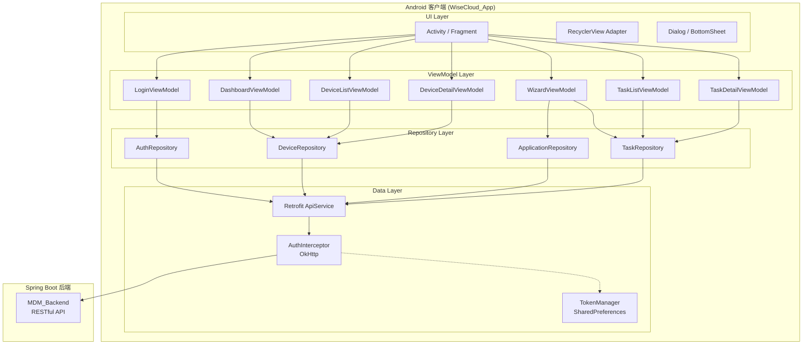
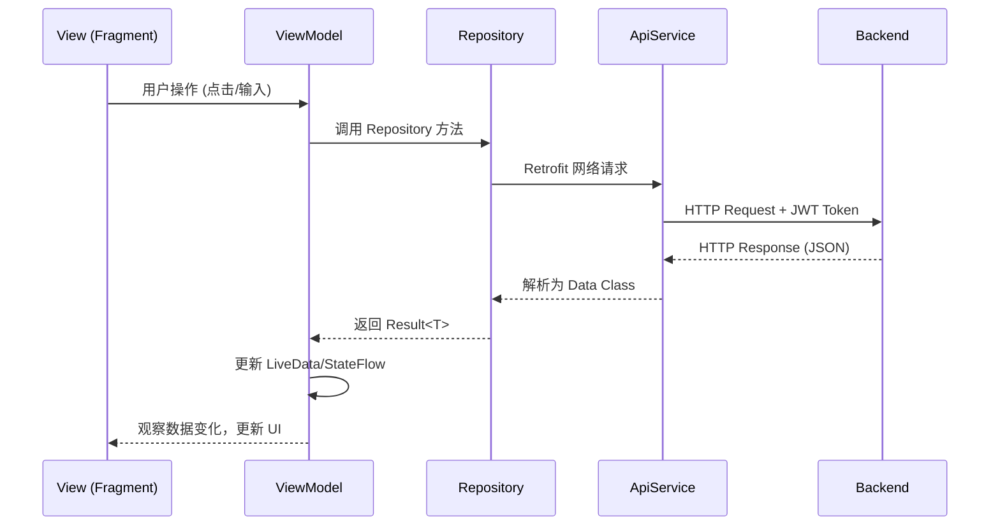
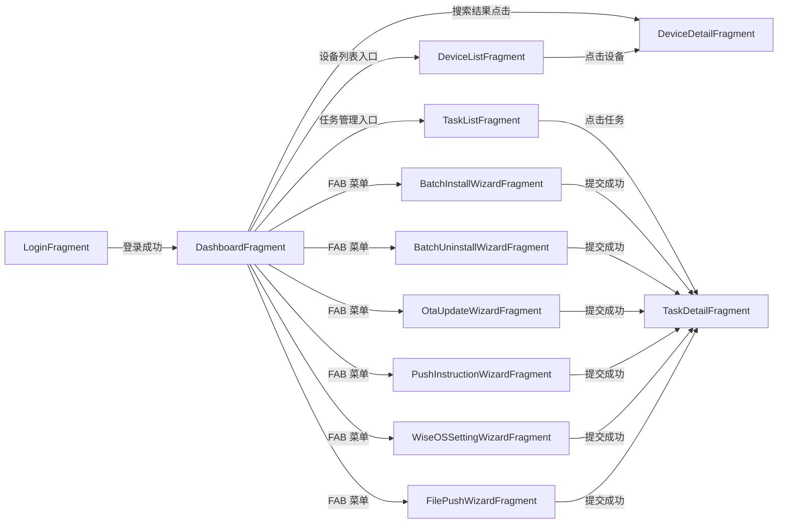

# 设计文档 — WiseCloud 移动端 App（Android 客户端）

## 概述

本设计文档描述 WiseCloud 移动端 Android 客户端（WiseCloud_App）的技术架构与实现方案。该应用是 WiseCloud 移动设备管理平台的移动端入口，通过调用 Spring Boot 后端 RESTful API 实现对商用 Android 设备（POS 终端）的远程管理。

核心技术栈：
- 语言：Kotlin
- 架构模式：MVVM（Model-View-ViewModel）
- Jetpack 组件：ViewModel、LiveData、Navigation Component、Coroutines、Room（可选本地缓存）
- 网络层：Retrofit 2 + OkHttp 4 + Gson
- UI 框架：Material Design Components 3
- 图表：MPAndroidChart
- 地图：Leaflet（WebView 嵌入）或 osmdroid
- 图片加载：Coil
- 依赖注入：Hilt

后端 API 基于已设计的 `wisecloud-device-management` 规格，提供以下核心端点：
- `POST /api/auth/login` — 用户登录
- `GET /api/devices/overview` — 设备概览统计
- `GET /api/devices/search` — SN 模糊搜索
- `GET /api/devices/{sn}/detail` — 设备详情
- `GET /api/devices` — 设备列表（分页）
- `POST /api/tasks/install` — 批量安装任务
- `POST /api/tasks/uninstall` — 批量卸载任务
- `POST /api/tasks/ota` — 批量 OTA 更新
- `POST /api/tasks/instruction` — 批量推送指令
- `POST /api/tasks/wiseos-setting` — 批量系统设置
- `POST /api/tasks/file-push` — 批量文件推送
- `GET /api/tasks` — 任务列表
- `GET /api/tasks/{traceId}/details` — 任务详情

## 架构

### 高层架构



### MVVM 数据流



### 导航图




## 组件与接口

### 项目包结构

```
com.wisecloud.app
├── di/                          # Hilt 依赖注入模块
│   ├── NetworkModule.kt         # Retrofit、OkHttp、Gson 配置
│   └── RepositoryModule.kt      # Repository 绑定
├── data/
│   ├── api/
│   │   └── MdmApiService.kt     # Retrofit 接口定义
│   ├── model/                   # API 数据模型 (data class)
│   │   ├── request/             # 请求体
│   │   └── response/            # 响应体
│   ├── repository/
│   │   ├── AuthRepository.kt
│   │   ├── DeviceRepository.kt
│   │   ├── TaskRepository.kt
│   │   └── ApplicationRepository.kt
│   └── local/
│       └── TokenManager.kt      # JWT Token 安全存储
├── ui/
│   ├── auth/
│   │   ├── LoginFragment.kt
│   │   └── LoginViewModel.kt
│   ├── dashboard/
│   │   ├── DashboardFragment.kt
│   │   └── DashboardViewModel.kt
│   ├── device/
│   │   ├── list/
│   │   │   ├── DeviceListFragment.kt
│   │   │   ├── DeviceListViewModel.kt
│   │   │   └── DeviceListAdapter.kt
│   │   └── detail/
│   │       ├── DeviceDetailFragment.kt
│   │       ├── DeviceDetailViewModel.kt
│   │       └── InstalledAppAdapter.kt
│   ├── wizard/
│   │   ├── common/
│   │   │   ├── StepIndicatorView.kt       # 自定义步骤指示器
│   │   │   └── DeviceTagSelectFragment.kt  # 可复用的设备标签选择
│   │   ├── install/
│   │   │   ├── BatchInstallWizardFragment.kt
│   │   │   └── BatchInstallViewModel.kt
│   │   ├── uninstall/
│   │   │   ├── BatchUninstallWizardFragment.kt
│   │   │   └── BatchUninstallViewModel.kt
│   │   ├── ota/
│   │   │   ├── OtaUpdateWizardFragment.kt
│   │   │   └── OtaUpdateViewModel.kt
│   │   ├── instruction/
│   │   │   ├── PushInstructionWizardFragment.kt
│   │   │   └── PushInstructionViewModel.kt
│   │   ├── wiseos/
│   │   │   ├── WiseOSSettingWizardFragment.kt
│   │   │   └── WiseOSSettingViewModel.kt
│   │   └── filepush/
│   │       ├── FilePushWizardFragment.kt
│   │       └── FilePushViewModel.kt
│   └── task/
│       ├── list/
│       │   ├── TaskListFragment.kt
│       │   ├── TaskListViewModel.kt
│       │   └── TaskListAdapter.kt
│       └── detail/
│           ├── TaskDetailFragment.kt
│           ├── TaskDetailViewModel.kt
│           └── TaskDeviceAdapter.kt
├── util/
│   ├── AuthInterceptor.kt       # OkHttp 拦截器（JWT 注入 + 401 处理）
│   ├── InputValidator.kt        # 输入校验工具（邮箱、密码等）
│   ├── DeviceFilterUtil.kt      # 设备筛选工具
│   ├── TaskFilterUtil.kt        # 任务筛选工具
│   ├── TaskProgressUtil.kt      # 任务进度计算工具
│   ├── BatteryColorUtil.kt      # 电量颜色映射工具
│   └── Extensions.kt            # Kotlin 扩展函数
├── widget/
│   ├── MfaInputView.kt          # MFA 6 位数字输入自定义 View
│   ├── StepIndicatorView.kt     # 向导步骤指示器
│   └── BatchMenuBottomSheet.kt  # 批量操作底部菜单
└── WiseCloudApp.kt              # Application 入口（Hilt）
```

### Retrofit API 接口定义

```kotlin
interface MdmApiService {

    // ===== 认证 =====
    @POST("api/auth/login")
    suspend fun login(@Body request: LoginRequest): ApiResponse<LoginResponse>

    @POST("api/auth/send-code")
    suspend fun sendVerificationCode(@Body request: SendCodeRequest): ApiResponse<Unit>

    // ===== 设备 =====
    @GET("api/devices/overview")
    suspend fun getDeviceOverview(): ApiResponse<DeviceOverviewResponse>

    @GET("api/devices/search")
    suspend fun searchDevices(@Query("keyword") keyword: String): ApiResponse<List<DeviceSummary>>

    @GET("api/devices")
    suspend fun getDeviceList(
        @Query("page") page: Int,
        @Query("size") size: Int = 20,
        @Query("status") status: Int? = null  // null=全部, 1=在线, 2=离线
    ): ApiResponse<PagedResponse<DeviceSummary>>

    @GET("api/devices/{sn}/detail")
    suspend fun getDeviceDetail(@Path("sn") sn: String): ApiResponse<DeviceDetailResponse>

    // ===== 应用 =====
    @GET("api/applications")
    suspend fun getApplicationList(): ApiResponse<List<ApplicationInfo>>

    @Multipart
    @POST("api/applications/upload")
    suspend fun uploadApk(
        @Part file: MultipartBody.Part,
        @Part("appAlias") appAlias: RequestBody,
        @Part("appDescription") appDescription: RequestBody?
    ): ApiResponse<AppUploadResponse>

    // ===== 任务 =====
    @POST("api/tasks/install")
    suspend fun createInstallTask(@Body request: InstallTaskRequest): ApiResponse<TaskCreateResponse>

    @POST("api/tasks/uninstall")
    suspend fun createUninstallTask(@Body request: UninstallTaskRequest): ApiResponse<TaskCreateResponse>

    @POST("api/tasks/ota")
    suspend fun createOtaTask(@Body request: OtaTaskRequest): ApiResponse<TaskCreateResponse>

    @POST("api/tasks/instruction")
    suspend fun createInstructionTask(@Body request: InstructionTaskRequest): ApiResponse<TaskCreateResponse>

    @POST("api/tasks/wiseos-setting")
    suspend fun createWiseOSSettingTask(@Body request: WiseOSSettingRequest): ApiResponse<TaskCreateResponse>

    @POST("api/tasks/file-push")
    suspend fun createFilePushTask(@Body request: FilePushRequest): ApiResponse<TaskCreateResponse>

    @GET("api/tasks")
    suspend fun getTaskList(
        @Query("type") type: String? = null,
        @Query("keyword") keyword: String? = null
    ): ApiResponse<List<TaskSummary>>

    @GET("api/tasks/{traceId}/details")
    suspend fun getTaskDetails(
        @Path("traceId") traceId: String,
        @Query("status") status: Int? = null,
        @Query("page") page: Int = 1,
        @Query("size") size: Int = 20
    ): ApiResponse<TaskDetailResponse>
}
```

### 核心组件签名

#### TokenManager — JWT Token 安全存储

```kotlin
class TokenManager(private val context: Context) {

    private val prefs: SharedPreferences =
        context.getSharedPreferences("auth_prefs", Context.MODE_PRIVATE)

    fun saveToken(token: String)
    fun getToken(): String?
    fun clearToken()
    fun isLoggedIn(): Boolean

    // Remember Password 功能
    fun saveCredentials(email: String, password: String)
    fun getSavedCredentials(): Pair<String, String>?
    fun clearCredentials()
}
```

#### AuthInterceptor — OkHttp 拦截器

```kotlin
class AuthInterceptor(private val tokenManager: TokenManager) : Interceptor {

    override fun intercept(chain: Interceptor.Chain): Response {
        val originalRequest = chain.request()
        val requestBuilder = originalRequest.newBuilder()

        // 非登录接口自动附加 JWT Token
        if (!originalRequest.url.encodedPath.contains("auth")) {
            tokenManager.getToken()?.let { token ->
                requestBuilder.addHeader("Authorization", "Bearer $token")
            }
        }

        val response = chain.proceed(requestBuilder.build())

        // 401 响应：Token 过期，清除并通知 UI 跳转登录
        if (response.code == 401) {
            tokenManager.clearToken()
            TokenExpiredEvent.post()
        }

        return response
    }
}
```

#### InputValidator — 输入校验工具

```kotlin
object InputValidator {

    private val EMAIL_REGEX = Regex(
        "^[A-Za-z0-9+_.-]+@[A-Za-z0-9.-]+\\.[A-Za-z]{2,}$"
    )

    /** 校验邮箱格式是否合法 */
    fun isValidEmail(email: String): Boolean = EMAIL_REGEX.matches(email.trim())

    /** 校验密码强度（至少 8 位） */
    fun isValidPassword(password: String): Boolean = password.length >= 8

    /** 校验 MFA 验证码（6 位纯数字） */
    fun isValidMfaCode(code: String): Boolean = code.length == 6 && code.all { it.isDigit() }

    /** 校验邮箱验证码（非空） */
    fun isValidVerificationCode(code: String): Boolean = code.isNotBlank()
}
```

#### DeviceFilterUtil — 设备筛选工具

```kotlin
object DeviceFilterUtil {

    enum class OnlineFilter { ALL, ONLINE, OFFLINE }

    /**
     * 按在线状态筛选设备列表
     * @param devices 原始设备列表
     * @param filter 筛选条件
     * @return 筛选后的设备列表
     */
    fun filterByOnlineStatus(
        devices: List<DeviceSummary>,
        filter: OnlineFilter
    ): List<DeviceSummary> = when (filter) {
        OnlineFilter.ALL -> devices
        OnlineFilter.ONLINE -> devices.filter { it.onlineStatus == 1 }
        OnlineFilter.OFFLINE -> devices.filter { it.onlineStatus == 2 }
    }
}
```

#### TaskFilterUtil — 任务筛选工具

```kotlin
object TaskFilterUtil {

    /**
     * 按任务类型筛选任务列表
     * @param tasks 原始任务列表
     * @param type 筛选类型，null 表示全部
     * @return 筛选后的任务列表
     */
    fun filterByType(
        tasks: List<TaskSummary>,
        type: String?
    ): List<TaskSummary> = if (type == null) tasks
        else tasks.filter { it.taskType == type }
}
```

#### TaskProgressUtil — 任务进度计算工具

```kotlin
object TaskProgressUtil {

    data class TaskProgress(
        val completedCount: Int,
        val failedCount: Int,
        val executingCount: Int,
        val preparingCount: Int,
        val totalCount: Int,
        val progressPercent: Float,   // 0.0 ~ 1.0
        val progressText: String      // e.g. "7/12 Completed"
    )

    /**
     * 根据设备状态列表计算任务进度
     * @param statuses 设备执行状态列表
     * @return 进度信息
     */
    fun calculateProgress(statuses: List<TaskDeviceStatus>): TaskProgress

    /**
     * 按 instructionStatus 分组设备状态
     * @param statuses 设备执行状态列表
     * @return 四组分组结果 (completed, failed, executing, preparing)
     */
    fun groupByStatus(statuses: List<TaskDeviceStatus>): TaskStatusGroups

    /**
     * 判断任务是否全部到达终态
     * @param statuses 设备执行状态列表
     * @return 当且仅当所有设备 instructionStatus 为 3 或 4 时返回 true
     */
    fun isAllTerminal(statuses: List<TaskDeviceStatus>): Boolean =
        statuses.all { it.instructionStatus == 3 || it.instructionStatus == 4 }
}

data class TaskStatusGroups(
    val completed: List<TaskDeviceStatus>,   // instructionStatus = 3
    val failed: List<TaskDeviceStatus>,      // instructionStatus = 4
    val executing: List<TaskDeviceStatus>,   // instructionStatus = 2
    val preparing: List<TaskDeviceStatus>    // instructionStatus = 1
)
```

#### BatteryColorUtil — 电量颜色映射工具

```kotlin
object BatteryColorUtil {

    /**
     * 根据电量百分比返回对应颜色
     * @param batteryLevel 电量百分比 (0-100)
     * @return 颜色资源 ID
     *   - 0~20: 红色 (R.color.battery_low)
     *   - 21~50: 黄色 (R.color.battery_medium)
     *   - 51~100: 绿色 (R.color.battery_high)
     */
    fun getColor(batteryLevel: Int): Int = when {
        batteryLevel <= 20 -> R.color.battery_low
        batteryLevel <= 50 -> R.color.battery_medium
        else -> R.color.battery_high
    }
}
```

#### LoginViewModel

```kotlin
@HiltViewModel
class LoginViewModel @Inject constructor(
    private val authRepository: AuthRepository,
    private val tokenManager: TokenManager
) : ViewModel() {

    // UI 状态
    val loginState: LiveData<LoginUiState>
    val countdownSeconds: LiveData<Int>       // 验证码倒计时
    val verifyMethod: LiveData<VerifyMethod>  // EMAIL 或 MFA

    // 用户操作
    fun login(email: String, password: String, verifyCode: String)
    fun sendVerificationCode(email: String)
    fun switchVerifyMethod()
    fun loadSavedCredentials()
    fun saveCredentials(email: String, password: String, remember: Boolean)
}

enum class VerifyMethod { EMAIL, MFA }

sealed class LoginUiState {
    object Idle : LoginUiState()
    object Loading : LoginUiState()
    data class Success(val token: String) : LoginUiState()
    data class Error(val message: String) : LoginUiState()
    object NetworkError : LoginUiState()
}
```

#### DashboardViewModel

```kotlin
@HiltViewModel
class DashboardViewModel @Inject constructor(
    private val deviceRepository: DeviceRepository
) : ViewModel() {

    val overview: LiveData<DeviceOverviewResponse>
    val searchResults: LiveData<List<DeviceSummary>>
    val weeklyActivity: LiveData<List<DailyActivity>>

    // 300ms 防抖搜索
    private val searchQuery = MutableStateFlow("")

    init {
        viewModelScope.launch {
            searchQuery
                .debounce(300)
                .filter { it.isNotBlank() }
                .collectLatest { query ->
                    val result = deviceRepository.searchDevices(query)
                    _searchResults.value = result
                }
        }
    }

    fun onSearchQueryChanged(query: String)
    fun loadOverview()
    fun loadWeeklyActivity()
}
```

#### TaskDetailViewModel — 含轮询逻辑

```kotlin
@HiltViewModel
class TaskDetailViewModel @Inject constructor(
    private val taskRepository: TaskRepository
) : ViewModel() {

    val taskDetails: LiveData<TaskStatusGroups>
    val isPolling: LiveData<Boolean>
    val currentTab: LiveData<Int>  // instructionStatus 值

    private var pollingJob: Job? = null

    companion object {
        const val POLL_INTERVAL_MS = 10_000L
    }

    fun loadTaskDetails(traceId: String, statusFilter: Int? = null)

    /**
     * 启动轮询：每 10 秒查询一次，全部到终态后自动停止
     */
    fun startPolling(traceId: String) {
        pollingJob?.cancel()
        pollingJob = viewModelScope.launch {
            while (isActive) {
                val result = taskRepository.getTaskDetails(traceId)
                _taskDetails.value = TaskProgressUtil.groupByStatus(result.statuses)
                if (TaskProgressUtil.isAllTerminal(result.statuses)) break
                delay(POLL_INTERVAL_MS)
            }
        }
    }

    fun stopPolling() {
        pollingJob?.cancel()
    }

    override fun onCleared() {
        super.onCleared()
        stopPolling()
    }
}
```

## 数据模型

### API 请求数据模型

```kotlin
// ===== 认证 =====
data class LoginRequest(
    val email: String,
    val password: String,
    val verifyCode: String,
    val verifyMethod: String  // "email" 或 "mfa"
)

data class SendCodeRequest(
    val email: String
)

// ===== 批量安装 =====
data class InstallTaskRequest(
    val taskName: String,
    val versionMD5: String,
    val versionNumber: String,
    val versionName: String?,
    val appName: String?,
    val snList: List<String>,
    val wifiOnly: Boolean = false,
    val idleTimeEnabled: Boolean = false,
    val idleTimeFrom: String? = null,  // "HH:mm"
    val idleTimeTo: String? = null
)

// ===== 批量卸载 =====
data class UninstallTaskRequest(
    val taskName: String,
    val pkgName: String,
    val snList: List<String>
)

// ===== 批量 OTA =====
data class OtaTaskRequest(
    val taskName: String,
    val firmwareId: String,
    val snList: List<String>,
    val wifiOnly: Boolean = false,
    val idleTimeEnabled: Boolean = false,
    val idleTimeFrom: String? = null,
    val idleTimeTo: String? = null
)

// ===== 批量推送指令 =====
data class InstructionTaskRequest(
    val taskName: String,
    val instructionKey: String,
    val param: Map<String, Any>,
    val snList: List<String>
)

// ===== 批量 WiseOS 设置 =====
data class WiseOSSettingRequest(
    val taskName: String,
    val settings: Map<String, Any>,
    val snList: List<String>
)

// ===== 批量文件推送 =====
data class FilePushRequest(
    val taskName: String,
    val fileId: String,
    val targetPath: String,
    val snList: List<String>
)
```

### API 响应数据模型

```kotlin
// ===== 统一响应包装 =====
data class ApiResponse<T>(
    val code: Int,
    val message: String,
    val data: T?
)

data class PagedResponse<T>(
    val content: List<T>,
    val totalElements: Int,
    val totalPages: Int,
    val currentPage: Int
)

// ===== 认证 =====
data class LoginResponse(
    val token: String,
    val expiresIn: Long,
    val username: String
)

// ===== 设备 =====
data class DeviceOverviewResponse(
    val totalCount: Int,
    val onlineCount: Int,
    val onlineRate: String  // e.g. "85.7%"
)

data class DeviceSummary(
    val sn: String,
    val deviceName: String,
    val deviceType: String,
    val onlineStatus: Int,      // 1=在线, 2=离线
    val lastOnlineTime: String
)

data class DeviceDetailResponse(
    val sn: String,
    val deviceName: String,
    val deviceType: String,
    val status: Int,
    val onlineStatus: Int,
    val activationTime: String,
    val lastOnlineTime: String,
    val otaVersionName: String,
    val otaVersion: String,
    val electricRate: String,       // 电量百分比
    val wifiStatus: Int,
    val gprsStatus: Int,
    val wifiSignalStrength: Int,
    val longitude: String,
    val latitude: String,
    val merchantName: String,
    val storeName: String,
    val installApps: List<InstalledApp>
)

data class InstalledApp(
    val appPackage: String,
    val appName: String,
    val versionName: String,
    val lastUpdateTime: String
)

// ===== 应用 =====
data class ApplicationInfo(
    val appName: String,
    val appPackage: String,
    val appAlias: String,
    val appDescription: String?,
    val versions: List<AppVersion>
)

data class AppVersion(
    val versionMD5: String,
    val versionNumber: String,
    val versionName: String,
    val fileSize: Long,
    val uploadedAt: String
)

data class AppUploadResponse(
    val versionMD5: String,
    val versionNumber: String
)

// ===== 任务 =====
data class TaskCreateResponse(
    val traceId: String,
    val taskName: String
)

data class TaskSummary(
    val traceId: String,
    val taskName: String,
    val taskType: String,       // "install", "uninstall", "ota", "instruction", "wiseos", "filepush"
    val targetApp: String?,
    val deviceCount: Int,
    val completedCount: Int,
    val failedCount: Int,
    val progress: String,       // e.g. "7/12 Completed"
    val createdAt: String,
    val createdBy: String?
)

data class TaskDetailResponse(
    val traceId: String,
    val taskName: String,
    val taskType: String,
    val statuses: List<TaskDeviceStatus>,
    val totalCount: Int,
    val currentPage: Int,
    val totalPages: Int
)

data class TaskDeviceStatus(
    val sn: String,
    val instructionStatus: Int,  // 1=preparing, 2=executing, 3=successful, 4=failed
    val executeCode: String?,
    val executeMessage: String?,
    val updatedAt: String?
)
```

### 类图

```mermaid
classDiagram
    class MdmApiService {
        <<interface>>
        +login(LoginRequest) ApiResponse~LoginResponse~
        +getDeviceOverview() ApiResponse~DeviceOverviewResponse~
        +searchDevices(keyword) ApiResponse~List~DeviceSummary~~
        +getDeviceList(page, size, status) ApiResponse~PagedResponse~DeviceSummary~~
        +getDeviceDetail(sn) ApiResponse~DeviceDetailResponse~
        +getApplicationList() ApiResponse~List~ApplicationInfo~~
        +createInstallTask(InstallTaskRequest) ApiResponse~TaskCreateResponse~
        +createUninstallTask(UninstallTaskRequest) ApiResponse~TaskCreateResponse~
        +getTaskList(type, keyword) ApiResponse~List~TaskSummary~~
        +getTaskDetails(traceId, status, page, size) ApiResponse~TaskDetailResponse~
    }

    class AuthRepository {
        -apiService: MdmApiService
        -tokenManager: TokenManager
        +login(email, password, code, method) Result~LoginResponse~
        +sendCode(email) Result~Unit~
        +logout()
    }

    class DeviceRepository {
        -apiService: MdmApiService
        +getOverview() Result~DeviceOverviewResponse~
        +searchDevices(keyword) Result~List~DeviceSummary~~
        +getDeviceList(page, status) Result~PagedResponse~DeviceSummary~~
        +getDeviceDetail(sn) Result~DeviceDetailResponse~
    }

    class TaskRepository {
        -apiService: MdmApiService
        +createInstallTask(request) Result~TaskCreateResponse~
        +createUninstallTask(request) Result~TaskCreateResponse~
        +getTaskList(type, keyword) Result~List~TaskSummary~~
        +getTaskDetails(traceId, status, page) Result~TaskDetailResponse~
    }

    class TokenManager {
        -prefs: SharedPreferences
        +saveToken(token)
        +getToken() String?
        +clearToken()
        +isLoggedIn() Boolean
        +saveCredentials(email, password)
        +getSavedCredentials() Pair?
    }

    class InputValidator {
        <<object>>
        +isValidEmail(email) Boolean
        +isValidPassword(password) Boolean
        +isValidMfaCode(code) Boolean
    }

    class TaskProgressUtil {
        <<object>>
        +calculateProgress(statuses) TaskProgress
        +groupByStatus(statuses) TaskStatusGroups
        +isAllTerminal(statuses) Boolean
    }

    class BatteryColorUtil {
        <<object>>
        +getColor(batteryLevel) Int
    }

    class DeviceFilterUtil {
        <<object>>
        +filterByOnlineStatus(devices, filter) List~DeviceSummary~
    }

    class TaskFilterUtil {
        <<object>>
        +filterByType(tasks, type) List~TaskSummary~
    }

    AuthRepository --> MdmApiService
    AuthRepository --> TokenManager
    DeviceRepository --> MdmApiService
    TaskRepository --> MdmApiService
```



## 正确性属性（Correctness Properties）

*正确性属性是指在系统所有合法执行路径中都应成立的特征或行为——本质上是对系统行为的形式化陈述。属性是连接人类可读规格说明与机器可验证正确性保证之间的桥梁。*

### Property 1: 邮箱格式校验正确分类

*For any* 字符串输入，`InputValidator.isValidEmail()` 应满足：对符合 RFC 标准的邮箱地址（包含 `@` 和有效域名后缀）返回 `true`，对不包含 `@`、域名部分为空、或后缀少于 2 个字符的字符串返回 `false`。

**Validates: Requirements 1.1**

### Property 2: 凭证存储 Round-Trip

*For any* 非空的邮箱和密码字符串对，调用 `TokenManager.saveCredentials(email, password)` 后，`TokenManager.getSavedCredentials()` 应返回与原始输入完全相同的 `(email, password)` 对。

**Validates: Requirements 1.8**

### Property 3: 在线率计算正确性

*For any* 设备列表（每个设备有 `onlineStatus` 值 1 或 2），计算得到的 `onlineCount` 应等于 `onlineStatus == 1` 的设备数量，`onlineRate` 百分比应等于 `onlineCount / totalCount * 100`（totalCount > 0 时）。当 totalCount 为 0 时，onlineRate 应为 "0%"。

**Validates: Requirements 2.6**

### Property 4: 设备列表在线状态筛选完整性

*For any* 设备列表和筛选条件（ALL/ONLINE/OFFLINE），`DeviceFilterUtil.filterByOnlineStatus()` 的结果应满足：
- 当筛选条件为 ALL 时，结果等于原始列表
- 当筛选条件为 ONLINE 时，结果中所有设备的 `onlineStatus == 1`，且原始列表中所有 `onlineStatus == 1` 的设备都在结果中
- 当筛选条件为 OFFLINE 时，结果中所有设备的 `onlineStatus == 2`，且原始列表中所有 `onlineStatus == 2` 的设备都在结果中

**Validates: Requirements 3.3**

### Property 5: 电量颜色映射正确性

*For any* 整数电量值 `batteryLevel`（0 ≤ batteryLevel ≤ 100），`BatteryColorUtil.getColor()` 应满足：
- 0~20 返回红色（battery_low）
- 21~50 返回黄色（battery_medium）
- 51~100 返回绿色（battery_high）
且相同电量值始终返回相同颜色（幂等性）。

**Validates: Requirements 4.3**

### Property 6: 任务类型筛选完整性

*For any* 任务列表和筛选类型字符串 `type`，`TaskFilterUtil.filterByType()` 的结果应满足：
- 当 type 为 null 时，结果等于原始列表
- 当 type 非 null 时，结果中所有任务的 `taskType == type`，且原始列表中所有 `taskType == type` 的任务都在结果中

**Validates: Requirements 11.5**

### Property 7: 任务进度计算正确性

*For any* 设备状态列表（每个设备有 `instructionStatus` 值 1/2/3/4），`TaskProgressUtil.calculateProgress()` 应满足：
- `completedCount + failedCount + executingCount + preparingCount == totalCount`
- `progressPercent == (completedCount + failedCount) / totalCount`（totalCount > 0 时）
- `progressText` 格式为 `"{completedCount}/{totalCount} Completed"`

**Validates: Requirements 11.6**

### Property 8: 任务状态分组与终态检测

*For any* 设备状态列表（每个设备有 `instructionStatus` 值 1/2/3/4），`TaskProgressUtil.groupByStatus()` 和 `TaskProgressUtil.isAllTerminal()` 应满足：
- 四个分组（completed/failed/executing/preparing）互不相交
- 四个分组的并集等于原始列表
- `completed` 中所有设备 `instructionStatus == 3`
- `failed` 中所有设备 `instructionStatus == 4`
- `executing` 中所有设备 `instructionStatus == 2`
- `preparing` 中所有设备 `instructionStatus == 1`
- `isAllTerminal()` 返回 `true` 当且仅当 `executing` 和 `preparing` 分组均为空

**Validates: Requirements 12.3, 12.4, 12.10, 12.11**

## 错误处理

### 网络层错误处理策略

Android 客户端采用统一的 `Result<T>` 封装模式处理所有网络请求结果：

```kotlin
sealed class Result<out T> {
    data class Success<T>(val data: T) : Result<T>()
    data class Error(val code: Int, val message: String) : Result<Nothing>()
    object NetworkError : Result<Nothing>()
    object Loading : Result<Nothing>()
}
```

#### Repository 层统一异常捕获

```kotlin
abstract class BaseRepository {

    protected suspend fun <T> safeApiCall(
        apiCall: suspend () -> ApiResponse<T>
    ): Result<T> = try {
        val response = apiCall()
        if (response.code == 200 && response.data != null) {
            Result.Success(response.data)
        } else {
            Result.Error(response.code, response.message)
        }
    } catch (e: UnknownHostException) {
        Result.NetworkError
    } catch (e: SocketTimeoutException) {
        Result.NetworkError
    } catch (e: IOException) {
        Result.NetworkError
    } catch (e: HttpException) {
        Result.Error(e.code(), e.message())
    } catch (e: Exception) {
        Result.Error(-1, e.message ?: "未知错误")
    }
}
```

### 错误分类与 UI 处理

| 错误类型 | 触发条件 | UI 处理 |
|---------|---------|--------|
| 网络不可用 | `UnknownHostException` / `SocketTimeoutException` | Toast: "网络连接失败，请检查网络设置" |
| Token 过期 | HTTP 401 | 清除 Token，跳转 LoginFragment |
| 后端业务错误 | HTTP 4xx/5xx + error message | Toast/Snackbar 显示服务端返回的 message |
| WiseCloud 服务不可用 | HTTP 502 | Toast: "远程服务暂时不可用，请稍后重试" |
| 登录失败 | HTTP 401 (login) | 显示错误提示，保留邮箱输入 |
| 任务提交失败 | API 返回错误 | 显示错误信息，保留向导已填数据 |
| 空数据 | API 返回空列表 | 显示空状态 UI（图标 + 提示文字） |
| 文件上传失败 | 上传异常 | 显示错误信息 + 重试按钮 |

### OkHttp 超时配置

```kotlin
val okHttpClient = OkHttpClient.Builder()
    .connectTimeout(15, TimeUnit.SECONDS)
    .readTimeout(30, TimeUnit.SECONDS)
    .writeTimeout(30, TimeUnit.SECONDS)
    .addInterceptor(authInterceptor)
    .addInterceptor(HttpLoggingInterceptor().apply {
        level = if (BuildConfig.DEBUG)
            HttpLoggingInterceptor.Level.BODY
        else
            HttpLoggingInterceptor.Level.NONE
    })
    .build()
```

## 测试策略

### 测试分层

#### 1. 单元测试（Unit Tests）

使用 JUnit 5 + MockK，覆盖 ViewModel 和工具类：

- `LoginViewModel`：登录状态流转、倒计时逻辑、凭证保存/加载
- `DashboardViewModel`：防抖搜索逻辑、概览数据加载
- `DeviceListViewModel`：分页加载、筛选状态管理
- `TaskDetailViewModel`：轮询启停逻辑、标签页切换
- `InputValidator`：邮箱/密码/MFA 校验
- `DeviceFilterUtil`：设备筛选
- `TaskFilterUtil`：任务筛选
- `TaskProgressUtil`：进度计算、状态分组、终态检测
- `BatteryColorUtil`：电量颜色映射

重点：mock 掉 Repository 层，只测试纯业务逻辑和状态管理。

#### 2. 属性测试（Property-Based Tests）

使用 Kotest Property Testing（Kotlin 属性测试库），最少 100 次迭代，验证上述 8 个正确性属性：

- 每个属性测试必须引用设计文档中的属性编号
- 标签格式：`Feature: wisecloud-mobile-app, Property {N}: {property_text}`
- 重点属性：
  - 邮箱格式校验（Property 1）
  - 凭证存储 Round-Trip（Property 2）
  - 设备筛选完整性（Property 4）
  - 任务状态分组与终态检测（Property 8）

配置示例：
```kotlin
class TaskProgressUtilPropertyTest : FunSpec({

    // Feature: wisecloud-mobile-app, Property 8: 任务状态分组与终态检测
    test("groupByStatus 四组互不相交且并集等于原始列表") {
        checkAll(100, Arb.list(arbTaskDeviceStatus(), 0..500)) { statuses ->
            val groups = TaskProgressUtil.groupByStatus(statuses)
            val allGrouped = groups.completed + groups.failed + groups.executing + groups.preparing
            allGrouped.size shouldBe statuses.size
            allGrouped.toSet() shouldBe statuses.toSet()
            groups.completed.all { it.instructionStatus == 3 } shouldBe true
            groups.failed.all { it.instructionStatus == 4 } shouldBe true
            groups.executing.all { it.instructionStatus == 2 } shouldBe true
            groups.preparing.all { it.instructionStatus == 1 } shouldBe true
        }
    }

    // Feature: wisecloud-mobile-app, Property 8: 终态检测
    test("isAllTerminal 当且仅当无 executing 和 preparing") {
        checkAll(100, Arb.list(arbTaskDeviceStatus(), 0..500)) { statuses ->
            val expected = statuses.all { it.instructionStatus == 3 || it.instructionStatus == 4 }
            TaskProgressUtil.isAllTerminal(statuses) shouldBe expected
        }
    }
})
```

#### 3. UI 测试

使用 Espresso + Fragment Testing：

- 登录页面：邮箱/密码输入、验证方式切换、MFA 输入框焦点管理
- 仪表盘：搜索框交互、FAB 菜单弹出/关闭
- 设备列表：筛选切换、下拉刷新、分页加载
- 向导流程：步骤导航、表单填写、提交流程
- 任务详情：标签页切换、设备列表显示

#### 4. 集成测试

使用 MockWebServer 模拟后端 API：

- 完整登录流程（含 Token 存储和自动附加）
- 设备搜索 → 详情查看流程
- 批量安装向导完整流程
- 任务轮询启停流程
- 401 Token 过期自动跳转登录

### 测试覆盖目标

| 层级 | 覆盖率目标 | 重点 |
|-----|----------|-----|
| ViewModel 层 | ≥ 80% | 状态管理、业务逻辑 |
| 工具类 | ≥ 90% | 纯函数逻辑 |
| 属性测试 | 8 个属性 × 100 次 | 核心算法正确性 |
| UI 测试 | 核心页面 | 关键交互流程 |
| 集成测试 | 核心流程 | 端到端业务场景 |
